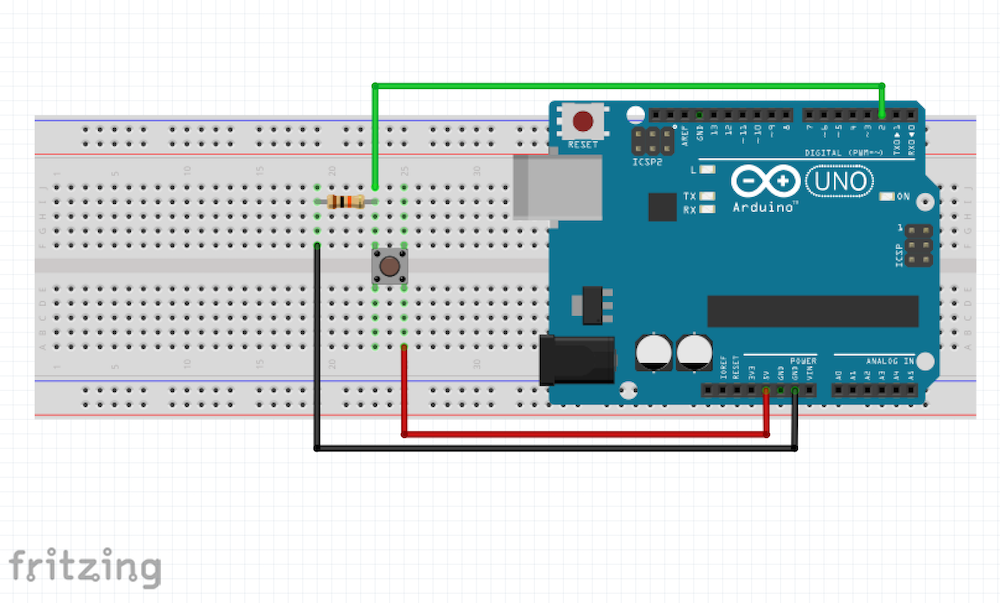

# 3. Pushbutton

We've looked at the following functions:

* digitalWrite()
* analogWrite()
* analogRead()

In this example, we're going to use [**digitalRead()**](https://www.arduino.cc/en/Reference/DigitalRead) to check whether a button is HIGH or LOW (i.e. on or off, 5 volts or 0 volts). Unlike analogRead(), digitalRead() doesn't return a range of values- it returns whether the pin is on or off.

## The Circuit



## Code
```c++
int ledPin = 13;
int buttonPin = 2;

void setup() {
    pinMode(ledPin, OUTPUT);
    pinMode(buttonPin, INPUT);
}

void loop() {
    if (digitalRead(buttonPin) == HIGH) {
        // if the button is HIGH/ on, turn the LED on
        digitalWrite(ledPin, HIGH);
    }
    else {
        digitalWrite(ledPin, LOW);
    }
}
```


