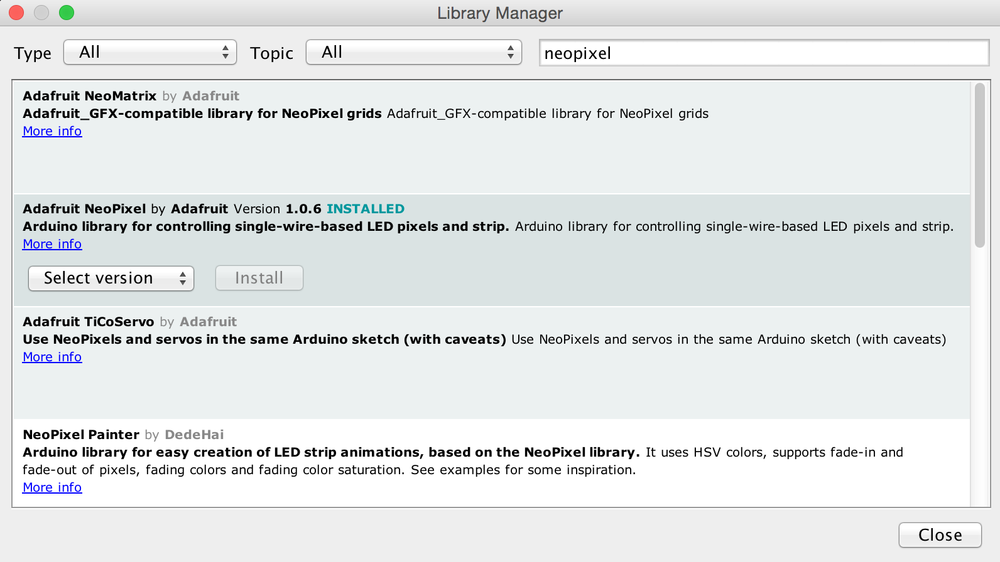
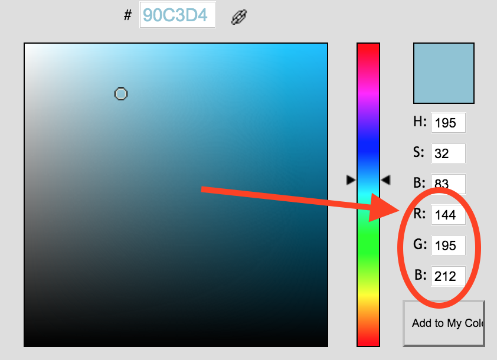

#5. Neopixels


[Neopixels](https://learn.adafruit.com/adafruit-neopixel-uberguide) are individually addressable, RGB LEDs. That means each LED in the strip can be its own color. RGB stands for red, green, blue. By selecting a value for each channel, we can create any color in the rainbow.

## Install Library
The first step is to install the Neopixel Library from the Library Manager:




## Wiring
Plugging in Neopixels is pretty straigtforward. Look closely at the strip. The GND jumper must go to GND, 5V to 5V, and the middle pin (data) can go to any digital pin. Most code uses pin 6.

## Bare Minimum Neopixel Sketch
Every Neopixel sketch must include the library by including this file:
```c++
#include <Adafruit_NeoPixel.h>
```

This next block of code defines which pin we're using to control the Neopixels and how many pixels are in our strip. We then initialize the "strip" (in other example files, it's called "pixels"; the name is irrelevant as long as we're consistent).

```c++
#define PIXEL_PIN    6   
#define PIXEL_COUNT  3

Adafruit_NeoPixel strip = Adafruit_NeoPixel(PIXEL_COUNT, PIXEL_PIN, NEO_GRB + NEO_KHZ800);
```

Next we have to begin the strip in the setup():

```c++
void setup() {
  strip.begin();
  strip.show(); 
}
```

Finally, we're ready to set the pixel color in the draw() with the function:

```c++
strip.setPixelColor( /* pixel # */ , strip.Color( /* red, green, blue */ ) ););
strip.show();
```

Putting it all together, we can write a sketch that turns the first two pixels red: 

```c++
#include <Adafruit_NeoPixel.h>   
#define PIXEL_PIN    6   
#define PIXEL_COUNT  7

Adafruit_NeoPixel strip = Adafruit_NeoPixel(PIXEL_COUNT, PIXEL_PIN, NEO_GRB + NEO_KHZ800);

void setup() {
  strip.begin();
  strip.show(); 
}

void loop() {
   strip.setPixelColor(0, strip.Color(255,0,0));
   strip.setPixelColor(1, strip.Color(255,0,0));
   strip.show();
}

```

The following functions can be used to control the pixels:
* **strip.setPixelColor**(pin, color)
* **strip.Color**(red, green, blue) - this function returns a color that can be used inside of strip.setPixelColor()
* **strip.clear**() - this function clears the colors (must be followed by strip.show())
* **strip.show**() - this function must be called after the pixel colors are set in order to see the changes
* **strip.setBrightness**() - sets the overall brightness of all the LEDs; takes a single argument, a number from 0 (off) to 255 (max brightness). 

To get a particular color of the rainbow, set the correct RGB values. Check out [http://www.colorpicker.com/](http://www.colorpicker.com/) to get the RGB values of any color:



**Exercise** 
**(1)** Set each LED to a different color of the rainbow.

**(2)** How do we turn the Neopixels off? Make the Neopixels blink.

**(3)** Open the example file StrandTest (File > Examples > Adafruit Neopixel > strandtest). What do each of the functions do? 

**(4)** Make the Neopixels fade in and out using a for loop and the setBrightness() function.